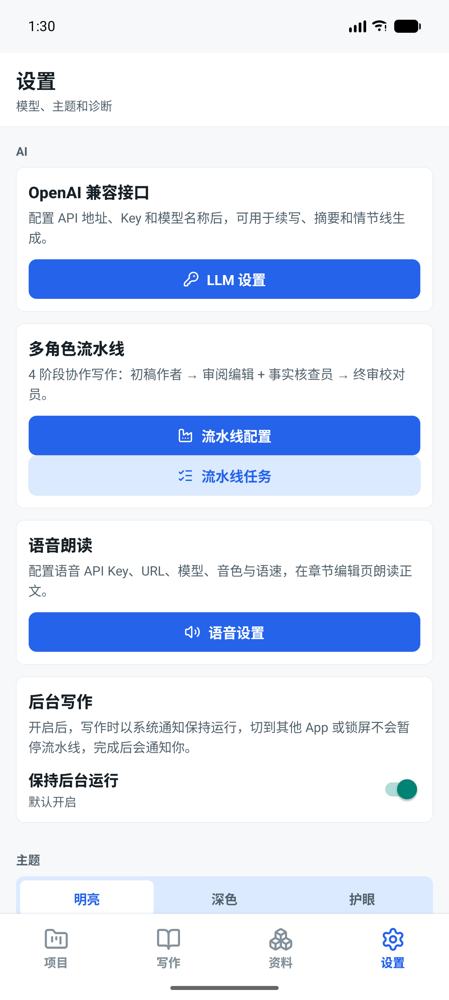

# ShineWriter / 小说工作台

<div align="center">

**Android 移动端小说创作、资料与 AI 工作台**

[](#技术栈与支持范围)
[](https://reactnative.dev/)
[](CHANGELOG.md)
[](#测试与质量门禁)

</div>

ShineWriter 是一款 Android-only 的离线优先小说工作台，覆盖项目管理、章节写作、角色与世界书、笔记资料库、多阶段 AI 流水线、TTS 朗读、备份与恢复。小说数据默认留在设备上；只有用户主动发起在线模型或云端语音请求时，相关内容才会发送到配置的服务商。

当前版本：**V2.5.17** · 数据库 Schema：**16** · 最低 Android API：**24**

`V2.5.17` 完成流水线修订闭环：修正 `twoStage` / `conditional` 阶段依赖错误（终审不再与评估/核查并行，必须接收真实报告）、`full` 模式 `review ∥ factCheck` 并行经实测验证（79s ≈ 理论 78.7s）、共享 `PipelineContextSnapshot` 快照消除跨阶段反查、初稿后二次本地召回；新增 LLM 设置保存后弹窗同步流水线 `max_tokens`（复用 50/15/15/20 比例）。模拟器 4 模式 E2E 全通过，914 个单元测试 + 10 个新测试。详见 [CHANGELOG](CHANGELOG.md)。

`V2.5.6` 将结构化故事记忆升级为检查点架构：默认智能更新、目标每 3 章一次批量整理；最近正文负责短期连续性，生成前不再无条件追平。Schema 16 新增 `project_story_memory_policy` 与 `story_memory_batches`。DeepSeek 30 章多人物多线验收见 [`docs/STORY-MEMORY-CHECKPOINT-TEST-REPORT.md`](docs/STORY-MEMORY-CHECKPOINT-TEST-REPORT.md)。

`V2.5.7` 收尾故事记忆可靠性：已覆盖章节的修改/删除与 dirty 标记、检查点批次失效进入同一 SQLite 事务；dirty 重建作废后续 applied 批次，避免复用旧世界状态。

`V2.5.8` 在现有 Checkpoint / Pending Bridge / Seam / Episodic TF-IDF 框架上强化长篇人物交互召回：约 300 字高密度 `memory_summary`、查询并入写作要求与上一章结尾、中文 n-gram、实体与人物组合加权、混合 Top-K，以及关系「姓名[ID]」渲染。**不增加**正文生成前远程 API 调用，**不改** Schema / 备份格式。

`V2.5.9` 收尾四项召回修复：Checkpoint 主路径摘要密度、不可用 Story Memory 禁止实体加权、Token 预算先优先级后时间序、共用别名歧义处理。详见 [CHANGELOG](CHANGELOG.md)、`docs/V2.5.9-STORY-MEMORY-RETRIEVAL-FIX-REPORT.md` 与 `docs/optimization/progress.md`。

`V2.5.10` 收尾两项边界修复：极小 Token 预算前缀安全截断；Story Memory 实体词在单次 Episodic 检索中只计算一次并复用。详见 [CHANGELOG](CHANGELOG.md)、`docs/V2.5.10-STORY-MEMORY-BOUNDARY-FIX-REPORT.md`。

`V2.5.11` 故事记忆召回最终收口：统一 Episodic 全路径 Token 安全预算、Story Memory 硬上限与人物/关系优先级、小 topK 分数优先、统一人物实体命名空间、用户写作要求进入 Story Memory、IDF 空回退最近摘要。详见 [CHANGELOG](CHANGELOG.md)、`docs/V2.5.11-STORY-MEMORY-FINAL-CLOSEOUT-REPORT.md`。

`V2.5.12` hardens story-memory contracts: target-aware checkpoint eligibility (no future injection), shared character mention resolver for query/candidate/Story Memory, explicit characterId→name maps, relationship-first budget bundles, true empty-query path proofs, system-invariant tests, and automatic version consistency gate. See [CHANGELOG](CHANGELOG.md) and `docs/V2.5.12-STORY-MEMORY-HARDENING-REPORT.md`.

`V2.5.13` 故事记忆最终硬化补丁：人物历史桶/计数/组合优先级只用 `matchedCharacterIds`（删除姓名 includes 回退）；歧义词参与最长匹配并占用区间（修复"队长/长""老林/林"误激活）；单次 `buildContext()` 全程复用 `prepareStoryMemoryForGeneration()` 返回的同一 Checkpoint 快照（不再二次读 DB）；GitHub Actions 增加真实 `Version consistency` 步骤；README 英文摘要与正式 APK 信息由脚本精确校验。详见 [CHANGELOG](CHANGELOG.md) 与 `docs/V2.5.13-STORY-MEMORY-FINAL-HARDENING-REPORT.md`。

`V2.5.16` 工程可靠性收口：非法目标章节 position 在 `prepareStoryMemoryForGeneration()` 中硬阻断上下文构建（不再继续 coverage / Episodic / 正文生成）；`invalid_position` 增加 `invalidPositionSource`（`target` | `checkpoint`）并修正 trace 文案；Release APK 主脚本强制复用 `Test-ApkSignerAcceptance` 作为唯一验收入口；README 改为“目标正式产物”措辞，不再把未签名验收的 APK 写成已交付。详见 [CHANGELOG](CHANGELOG.md) 与 `docs/V2.5.16-ENGINEERING-RELIABILITY-CLOSURE-REPORT.md`。

`V2.5.15` 工程可靠性最终补漏：Release APK 验证的 v2 签名校验彻底删除“检测到任意 `Verified using vN scheme` 行即视为 v2 成功”的兜底——`VerifiedV2` 只来自显式 `Verified using v2 scheme: true` 行，缺行或为 false 都 throw，解析逻辑拆到 `scripts/apk-verification-parsers.ps1` 并由真实 PowerShell 子进程测试覆盖；故事记忆检查点位置校验改为统一的 `isValidChapterPosition`（有限非负整数），目标章节位置先于 missing/dirty/empty/future 校验，非法 target 不再被掩盖；不可用 eligibility 结果改为判别联合，`usable=false` 时 `checkpoint` 恒为 `null`，类型层面无法再读到未来人物/秘密/关系；版本生成后缀契约澄清（干净 checkout 默认 0，同版本重跑保留合法 0–99 后缀防 versionCode 回退）；`buildContext()` 的最终 story_memory trace 合并逻辑封装为单一 `buildStoryMemoryTraceItem`。详见 [CHANGELOG](CHANGELOG.md) 与 `docs/V2.5.15-ENGINEERING-RELIABILITY-FINAL-FIX-REPORT.md`。

`V2.5.14` 工程可靠性硬化：版本生成不再自动读取 `GITHUB_RUN_NUMBER`（修复 CI 运行编号超过 99 后 `prebuild` 必然失败）；`PrepareStoryMemoryResult` 增加 `checkpointEligibility`，dirty/future/invalid 等不可用检查点在 trace 中保留具体原因（不再统一显示“尚无检查点”）；`buildContext()` 删除 `|| true` 死代码改为无条件调用 prepare；Release APK 验证脚本改为硬断言（证书 SHA-256、v2 scheme、signer=1、包名、versionName、versionCode、zipalign 全部 throw on mismatch）。详见 [CHANGELOG](CHANGELOG.md) 与 `docs/V2.5.14-ENGINEERING-RELIABILITY-HARDENING-REPORT.md`。

## 主要能力

| 模块 | 能力                                                                                        |
| ---- | ------------------------------------------------------------------------------------------- |
| 项目 | 创建、切换和删除小说项目；支持大纲模式与自由写作模式                                        |
| 写作 | 章节 CRUD、900ms 防抖自动保存、AI 续写/修订、草稿与版本回退、结构化故事记忆（检查点 + 重建） |
| 资料 | 角色卡 JSON/PNG 元数据导入、角色集合、世界书集合与条目、笔记资料库、预设                    |
| AI   | OpenAI 兼容在线 API；GGUF + Android llama.cpp；四阶段流水线；Checkpoint + Pending Bridge + Seam + 增强 Episodic 检索（中文 n-gram / 实体加权 / 混合 Top-K）；自动预算配置 |
| 语音 | 系统 TTS 与可配置语音服务；章节和选区朗读；前后台保活                                       |
| 备份 | Manifest 驱动的 v3 备份、SHA-256 校验、原子恢复、外部模型资源引用                           |
| 诊断 | LLM 用量日志、流水线任务状态、超时/取消/网络错误分类                                        |

## 技术栈与支持范围

- Android-only；`minSdk 24`，`compileSdk/targetSdk 36`。
- React Native `0.85.3`、React `19.2.3`、TypeScript `5.8`、Kotlin `2.1.20`。
- Node.js `>= 24.3.0`、JDK `17`、Android SDK 与 Gradle 环境。
- SQLite：数据库文件名为 `shine_writer.db`，位于 Android 应用私有数据目录，当前 Schema 为 16。
- 本地模型：仅支持 `.gguf`，由 Android `llama.cpp` JNI 引擎加载；模型文件放在应用私有模型目录，不上传服务器。
- 在线模型：OpenAI 兼容 Chat Completions 接口。默认只允许 HTTPS；局域网 HTTP 必须由用户显式开启，并限制在 `127.0.0.1`、`10/8`、`172.16/12`、`192.168/16`，公网 HTTP 永远拒绝。
- API Key：通过 `react-native-keychain` 写入 Android Keystore；`llm_config` 只保存配置名称、地址、模型等非密钥字段。备份文件不包含 API Key，恢复后需要重新填写。

## 数据、备份与隐私

- 章节、项目、资料、任务和用量日志默认保存在本机 SQLite；本地 GGUF 文件也保存在应用私有目录。
- 手动备份和自动备份写入应用专属外部目录的 `backups/` 子目录。
- v3 备份包含可恢复的业务表数据、Schema/应用版本和外部资源引用，并使用 SHA-256 校验；API Key 等凭据不进入备份。
- 恢复前会生成保护性备份，恢复过程使用原子事务；恢复的 LLM 配置不会带回旧设备的 Keychain 凭据。
- 在线 API 或云端语音调用时，API Key 和相应的小说文本会按服务商协议传输。开启局域网 HTTP 时，应用会明确提示内容可能以明文传输。

## 截图

| 项目首页                     | 写作页                        | LLM 设置                             |
| ---------------------------- | ----------------------------- | ------------------------------------ |
|  |  |  |

## 快速开始

```bash
git clone https://github.com/anjingdtl/tavo-mini.git
cd tavo-mini
npm ci
```

启动 Metro：

```bash
npm start
```

连接 Android 模拟器或真机后运行开发版：

```bash
npm run android
```

## 构建与发布

> **Release 构建必读：** 自动化 Agent 和维护者在生成正式 APK 前，必须先阅读 [Release APK 构建指南](docs/RELEASE_APK_BUILD.md)。指南包含用户级签名变量加载、原始签名身份校验、构建后验收和故障处理；不要新建 keystore 或使用 Debug 签名代替。

APK 统一交付路径是 `dist/apk/{debug|release}/`：

| 命令                           | 产物                                                  |
| ------------------------------ | ----------------------------------------------------- |
| `npm run apk:debug`            | `dist/apk/debug/ShineWriter-V{version}-debug.apk`     |
| `npm run apk:release`          | `dist/apk/release/ShineWriter-V{version}-release.apk` |
| `npm run apk:release:minified` | R8/资源压缩 Release 评估包                            |

目标正式产物：`dist/apk/release/ShineWriter-V2.5.17-release.apk`，`versionName=V2.5.17`，`versionCode=2051700`。

本轮 **已构建并验证** Release APK：本次发版已按 [Release APK 构建指南](docs/RELEASE_APK_BUILD.md) 执行 `npm run apk:release` + `apksigner verify` + `zipalign -c` + `aapt dump badging` 全套验收。

**实测验收数据**：

| 验收项 | 实测结果 |
|---|---|
| apksigner verify | Verifies，Verified v2 = true |
| 证书 SHA-256 | `017b3fbed4001083f2f70a0c51e8e463322df66b095e1c3a476fdd0d86dc2a0a`（与固定值一致） |
| Number of signers | 1 |
| zipalign -c | Verification successful |
| versionName / versionCode | V2.5.17 / 2051700 |
| 文件大小 | 37,422,535 bytes（35.69 MB） |
| APK SHA-256 | `97CE827B10E1F58A8BCEFA4C90F3D76D971DBC68D5E4BB70A68935241F695247` |

构建脚本会从 `package.json` 生成版本元数据、运行 Gradle，并把 APK 复制到上述交付目录。Release 构建必须显式提供以下环境变量，不会使用默认签名密码：

```text
SHINE_WRITER_RELEASE_STORE_FILE
SHINE_WRITER_RELEASE_STORE_PASSWORD
SHINE_WRITER_RELEASE_KEY_ALIAS
SHINE_WRITER_RELEASE_KEY_PASSWORD
```

主构建机将这些变量保存在 Windows 当前用户环境中。若 Agent、IDE 或终端在变量配置前已经启动，进程不会自动得到新值；请使用上述指南中的 PowerShell 安全加载片段，再运行 `npm run apk:release`。任何文档和日志都不得记录密码值。

发布后的 APK 从 [GitHub Releases](https://github.com/anjingdtl/tavo-mini/releases) 下载；尚未创建 Release 时，可在对应 GitHub Actions 运行页查看 CI 产物。每次正式发布还应在发布说明中附带 APK SHA-256。

## 测试与质量门禁

```bash
npm run lint
npm run typecheck
npm run test:ci
npm run test:coverage
npm run verify
```

V2.5.1 的结构化记忆基线记录在 [`docs/V2.5.1-STORY-MEMORY-TEST-REPORT.md`](docs/V2.5.1-STORY-MEMORY-TEST-REPORT.md)；V2.5.6 检查点架构与 30 章多人物多线验收记录在 [`docs/STORY-MEMORY-CHECKPOINT-TEST-REPORT.md`](docs/STORY-MEMORY-CHECKPOINT-TEST-REPORT.md)；V2.5.7 原子 dirty 事务与场景 C 收尾、V2.5.8 长篇召回优化见 [`docs/optimization/progress.md`](docs/optimization/progress.md)；V2.5.2–V2.5.8 的 DeepSeek/发布回归记录在 [`docs/RELEASE_CHECKLIST.md`](docs/RELEASE_CHECKLIST.md)。覆盖率门禁为全局 branches `55%`、functions `65%`、lines `65%`、statements `65%`，Schema、迁移、数据库和备份服务有更高的定向阈值。

`npx jest --runInBand --ci --detectOpenHandles` 可在 Node 24.14.1 上自然退出，不使用 `--forceExit`，无 open-handle 报告或超时。

V2.5.12 发布提交 `a6820cf` 的 GitHub Actions [Verify Run 29752469471](https://github.com/anjingdtl/tavo-mini/actions/runs/29752469471) 三个 Job（JavaScript validation / Android Debug build / Migration matrix）全部 success。详情见 [`docs/V2.5.12-STORY-MEMORY-HARDENING-REPORT.md`](docs/V2.5.12-STORY-MEMORY-HARDENING-REPORT.md)。

V2.5.13 发布提交 `6e5ac42` 的 run 因 `verify.yml` 的 `concurrency.cancel-in-progress` 被紧随其后的 docs commit `eddb4c6`（纯文档增量，无生产代码改动）取消，改由 `eddb4c6` 的 [Verify Run 29760694051](https://github.com/anjingdtl/tavo-mini/actions/runs/29760694051) 代替验证，三个 Job（JavaScript validation 含 Version consistency / Android Debug build / Migration matrix）全部 success。详情见 [`docs/V2.5.13-STORY-MEMORY-FINAL-HARDENING-REPORT.md`](docs/V2.5.13-STORY-MEMORY-FINAL-HARDENING-REPORT.md)。

V2.5.16 发布提交 `d5b2229` 的 [Verify Run 29810232127](https://github.com/anjingdtl/tavo-mini/actions/runs/29810232127) 三个 Job（JavaScript validation 含 Version consistency / Lint / TypeScript / Jest with coverage / Android Debug build / Migration matrix）全部 success；workflow head SHA 等于 `d5b2229e`，未被 concurrency 取消。真实 PowerShell 解析用例在 Linux CI 上 `describe.skip`，本机 Windows 已执行。详情见 [`docs/V2.5.16-ENGINEERING-RELIABILITY-CLOSURE-REPORT.md`](docs/V2.5.16-ENGINEERING-RELIABILITY-CLOSURE-REPORT.md)。

V2.5.15 发布提交 `d1e8524` 的 [Verify Run 29806417082](https://github.com/anjingdtl/tavo-mini/actions/runs/29806417082) 三个 Job（JavaScript validation 含 Version consistency / Lint / TypeScript / Jest with coverage / Android Debug build / Migration matrix）全部 success；workflow head SHA 等于 `d1e85245`，未被 concurrency 取消。真实 PowerShell 解析用例在 Linux CI 上 `describe.skip`，本机 Windows 已执行。详情见 [`docs/V2.5.15-ENGINEERING-RELIABILITY-FINAL-FIX-REPORT.md`](docs/V2.5.15-ENGINEERING-RELIABILITY-FINAL-FIX-REPORT.md)。

V2.5.14 发布提交 `11ebc5e` 的 [Verify Run 29801509982](https://github.com/anjingdtl/tavo-mini/actions/runs/29801509982) 三个 Job（JavaScript validation 含 Version consistency / Android Debug build / Migration matrix）全部 success；workflow head SHA 等于 `11ebc5e4`。本轮等待 Run 完整结束后才创建 docs pin commit，未被 concurrency 取消。详情见 [`docs/V2.5.14-ENGINEERING-RELIABILITY-HARDENING-REPORT.md`](docs/V2.5.14-ENGINEERING-RELIABILITY-HARDENING-REPORT.md)。

GitHub Actions `Verify` 对 `main` push 和 Pull Request 执行：

- JavaScript：lint、typecheck、Jest、coverage。
- Android Debug：`assembleDebug`。
- Migration matrix：迁移测试。

核心 UI 写作链路另有 `e2e/maestro/` 流程；真实 Android 验证使用 adb/UI tree 检查启动、项目/章节创建、自动保存、设置和持久化结果。

### V2.4.6 端到端穿测（emulator-5554 / Android 17）

V2.4.6 着重验证"上下文自动化配置"新功能与既有全功能回归。完整穿测报告含 6 张关键截图见 [`docs/V2.4.6-TEST-REPORT.md`](docs/V2.4.6-TEST-REPORT.md)，关键结论：

| 维度 | 结果 |
| ---- | ---- |
| 8 大模块穿测 | ✅ 项目列表 / 写作 Tab / 资料库 / 设置 / **上下文自动化** / 备份中心 / LLM 设置 / 语音设置 全部通过 |
| 新功能分配预览 | ✅ 13 个字段（输入 65/20/15 + 输出 50/15/15/20 + 资源级 + 同步写入）按设计比例精确显示 |
| 章节自动保存 | ✅ 900ms 防抖，冷启动后 9 字数据完整保留 |
| 备份 pre_restore 机制 | ✅ tap "恢复" 后自动生成快照 `manual_v2.4.6_<ts>.json` |
| 崩溃 / ANR | ✅ 0 |

发版前需处理的 **已知阻塞**：

- 🔴 **16KB 页大小对齐** — Android 15+ 强制要求；当前 `lib/{x86_64,arm64-v8a}/libllamacpp_jni.so`、`libreactnative.so`、`libhermesvm.so`、`libllama.so`、`libggml*.so`、`libsqliteJni.so` 等未对齐，需要更新 RN 0.85.x 16KB patch + llama.cpp 重编才能上架。

## 项目结构

```text
src/main/                         App 入口与主题/导航容器
src/navigation/                   Tab 与 Stack 导航
src/data/connection/              SQLite 连接、查询、事务边界
src/data/schema/                  当前 Schema 创建、初始化与运行时校验
src/data/repositories/            按领域拆分的数据访问层
src/services/llm/                 Provider、并发队列、超时和网络策略
src/services/storyMemory/         结构化记忆类型、校验、合并、LLM 补丁、渲染与重建
src/services/pipelineRunner.ts    多阶段 AI 流水线
src/screens/chapter-editor/       章节编辑器组件与 hooks
src/store/                        Zustand 状态仓库
android/                          Android 原生、llama.cpp JNI、前台服务
__tests__/                        Jest 与 React Native 测试
e2e/maestro/                      可移植的核心流程 E2E 定义
scripts/                          版本生成、依赖补丁和 APK 构建脚本
dist/apk/                         本地 APK 交付目录
```

## 已知限制

- 当前只维护 Android 工程，不提供 iOS 构建目标。
- GGUF 模型的速度、可用上下文长度和内存占用取决于设备、量化方式和模型模板；本地模型请求会串行化，低内存事件会暂停新任务。
- 不同 OpenAI 兼容服务商的流式字段和错误格式可能不同；连接、普通请求、章节/流水线和本地无进展超时会分类反馈，但不会替服务商修复配置问题。
- 局域网 HTTP 只适合可信网络；公网 HTTP 不支持绕过安全策略。
- API Key 不随备份迁移，这是刻意的隐私边界；换设备或恢复备份后需要重新填写。
- TTS 的可用音色、后台行为和性能受 Android 版本及设备厂商实现影响。
- API 37 x86_64 模拟器会报告部分原生库的 16KB page-size/RELRO 兼容提示；ARM64 物理设备发布前仍需补验。
- V2.5.6 已完成 x86_64 模拟器上的检查点架构 30 章多人物多线验收（11 人物 / 25 关系 / 10 批次 / through=29 clean）；arm64 真机与本地 GGUF 长上下文仍需专项验收。
- V2.5.7 将 **章节 UPDATE/DELETE 与故事记忆 dirty / 批次失效合并为同一 SQLite 事务**（失败整笔回滚），并纳入 dirty 重建作废后续 applied 批次的修复。场景 C 与原子 dirty 模拟器路径产品侧均为 **PASS**。本地证据（gitignore）：`test-logs/story-memory-scenario-c-signoff/`、`test-logs/story-memory-atomic-dirty-final/`。
- V2.5.8 强化 Episodic 召回（查询/分词/实体加权/混合 Top-K）与约 300 字记忆摘要提示词；**不扩大**默认上下文预算、**不增加**正文前 API 调用、**不改** Schema。旧 `memory_summary` 可继续参与检索，无需强制全量重写。
- 残余风险：进程被强杀后可能卡在 `rebuilding`，此时 UI「立即整理」不会自动走 dirty 重建入口（需恢复为 dirty 或重启流程）；删除中间章后覆盖 through 可能收敛；完整中文 IME 改正文未作为门禁重录；arm64 真机与本地 GGUF 长上下文仍需专项验收。

## English summary

ShineWriter is an Android-only, offline-first novel-writing workspace built with React Native 0.85.3 and TypeScript. It includes project/chapter editing, character and world-book libraries, notes, a four-stage AI pipeline, TTS, backups, OpenAI-compatible APIs, and local GGUF inference through Android llama.cpp.

The current version is **V2.5.17** with database Schema **16**. Story memory uses a checkpoint architecture (smart interval, typically every 3 chapters) with Checkpoint + Pending Bridge + Seam context, soft-skip for missing entity refs, and atomic local finalization before long-term memory. V2.5.17 closes the pipeline revision loop: fixes `twoStage` / `conditional` stage dependencies (final proof no longer runs in parallel with review/factCheck, must receive real reports), `full` mode `review ∥ factCheck` parallelism verified by E2E (79s ≈ theoretical 78.7s), shared `PipelineContextSnapshot` eliminates cross-stage re-queries, post-draft secondary local retrieval added; new prompt to sync pipeline `max_tokens` after LLM settings save (reuses 50/15/15/20 ratio). Emulator 4-mode E2E all passed. The app stores SQLite data and local models on-device. API keys remain in Android Keystore and are excluded from backups.

## License

MIT License — see [LICENSE](LICENSE).
