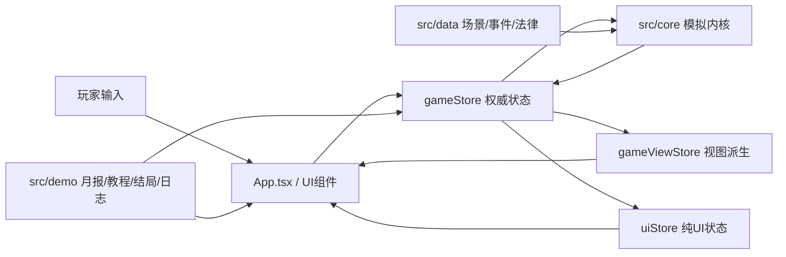
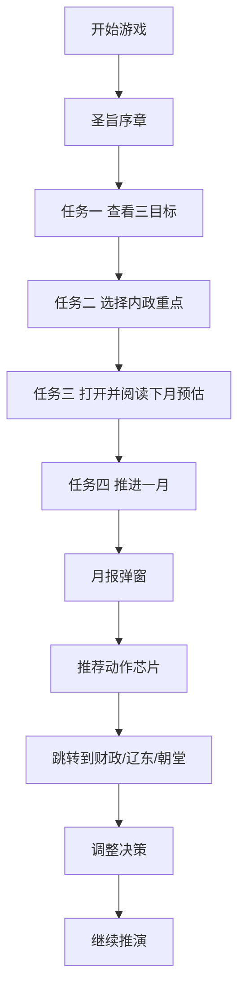

# MING-WAR DEMO 体验优化深度研究报告

## 执行摘要

我对 `anjingdtl/MING-WAR` 仓库进行了以源码、README、已知问题、试玩指南、变更记录与进度文档为主的静态审查，并从专业游戏设计师视角，重点评估“**在尽量不改动现有代码架构**”前提下，哪些改动最能显著提升玩家体验。仓库当前公开文档显示这是一个基于 **React 19 + TypeScript + Vite 6 + Zustand** 的 Web 端策略 DEMO，采用 `gameStore / gameViewStore / uiStore` 三层状态拆分，且 `src/core/` 被明确设为“确定性模拟红线，尽量不改”。README 的运行要求是 Node.js ≥ 18、npm ≥ 9，浏览器为近两版 Chrome / Edge / Firefox，入口命令为 `npm install`、`npm run demo` 与 `npm run demo:smoke`。citeturn39view0turn40view0turn15view1

本次研究中，我**尝试在当前执行环境下载并运行仓库**，但容器网络解析 GitHub 失败，`git clone` 返回 `Could not resolve host: github.com`，因此**无法完成真实编译与试玩**；下面的“快速体验”与“问题清单”依据仓库自述的目标流程、已知问题、代码路径和 UI 逻辑进行静态复盘，而不是基于实机录像。与此同时，仓库文档本身存在**版本基线漂移**：README 仍写“音效 / BGM 不在范围”，而 `PROGRESS.md` 已记录 **TASK-120 音频系统完成**、新增 `src/demo/audio/` 与 `public/audio/` 资源，这说明代码状态已经晚于 README。citeturn39view0turn42view0turn12view0turn13view0

从“低改动高收益”的角度，我认为最值得立刻做的不是改模拟内核，而是优先修复 **教程完成条件过弱、月报到行动的闭环不够强、结局复盘内容未真正接通、推进按钮缺少运行态防抖、TopBar 解释信息可发现性差、低分辨率阅读压力偏高** 这几个点。它们几乎都能在 `src/app/`、`src/ui/demo/`、`src/ui/panels/`、`src/store/`、`src/demo/` 内完成，不需要穿透 `src/core/`。这与仓库 HANDOFF 文档中的限制完全一致：**核心模拟 0 改动，优先在 demo / ui / store / app 层迭代**。citeturn15view1turn39view0

## 执行步骤与假设

本报告采用了下面这套执行顺序：

1. 读取仓库公开入口文档，确认版本、运行要求、Demo 目标流程、目录结构与验证脚本。citeturn39view0turn40view0  
2. 读取 `PLAYTEST_GUIDE.md`、`KNOWN_ISSUES.md`、`CHANGELOG.md`、`PROGRESS.md` 与 `HANDOFF.md`，交叉核对“产品承诺”“已知缺陷”“当前真实状态”“后续写法红线”。citeturn15view0turn15view1turn16view0turn16view2turn41view0turn42view0  
3. 重点审查关键路径文件：`src/app/App.tsx`、`src/store/gameStore.ts`、`src/store/uiStore.ts`、`src/ui/panels/DecisionPanel.tsx`、`DecisionPrediction.tsx`、`TopBar.tsx`、`src/ui/demo/*`、`src/demo/*`。citeturn10view0turn10view1turn10view4turn32view0turn31view2turn43view0turn26view2turn36view1  
4. 基于同类轻量策略游戏的成熟做法，提炼“可解释性、行动闭环、信息密度、反馈节奏、可重玩性”的改进方向。官方资料显示，**Into the Breach** 的核心卖点是“敌方攻击完全前置展示、每回合都能推导完美应对”，**Bad North** 强调“少量命令 + 岛屿地形带来的高可读战术”，**Thronefall** 明确主打“剥离不必要复杂性、短时完成一局”的轻量战略体验。citeturn38search15turn37search2turn37search14

在无法实机运行的前提下，我采用以下假设：

| 假设项 | 本报告采用的处理方式 |
|---|---|
| 目标平台未指定 | 按仓库 README 的 Web 桌面端 DEMO 处理。citeturn39view0 |
| 目标用户群未指定 | 按 `PLAYTEST_GUIDE` 中“陌生玩家 30 分钟内走完流程”的可理解性标准处理。citeturn15view0 |
| 团队规模与预算未指定 | 默认按 1–2 名前端/玩法设计协作的小团队节奏，优先低中改动方案。 |
| 运行验证受限 | 先做静态代码审查，并将“无法在当前环境运行”明确写入结论。 |

当前我确认到的**环境需求**与**建议运行方式**如下：Node.js ≥ 18，推荐 20 LTS；npm ≥ 9；近两版 Chrome / Edge / Firefox；推荐分辨率 ≥ 1366×768；标准流程为 `npm install` → `npm run demo`，以及用于快速验证的 `npm run demo:smoke`。依赖层面主要是 React 19、TypeScript 5.7、Vite 6、Zustand 5、Vitest 3、jsdom、fake-indexeddb 与 xlsx。citeturn39view0turn40view0

## 快速体验与问题清单

由于本环境未能真实启动 DEMO，下面的“复现步骤”以仓库自述流程和代码逻辑为依据，属于**静态可复现路径**。我优先列出那些会直接影响新手首局体验、理解成本、反馈节奏与复盘价值的问题。问题表中的“关键代码位置”优先给出最短路径。

静态体验分析显示，仓库目标流程是：主菜单 → 奏折式引导 → 5 步任务教程 → 决策 → 推进一月 → 月报 → 连续推演 24 月 → 结局。citeturn15view0turn39view0

| 问题 | 类型 | 可复现步骤 | 为什么伤体验 | 关键代码位置 |
|---|---|---|---|---|
| 教程第一步会自动完成 | 教程 | 清空 localStorage，开始游戏，进入教程后完成首折；由于目标卡默认展开，`inspect-goals` 会在 100ms 后自动完成 | 玩家并没有真正“查看并理解三目标”，却被系统判定完成，削弱新手引导的仪式感与确认感 | `App.tsx` 中 `inspect-goals` 自动完成逻辑，约 L1736–1750；`DemoGoalCard` 默认展开，约 L582–605。citeturn32view0turn34view2 |
| 教程第三步只要切到决策页签就算“看过预估” | 教程 | 教程推进到 `inspect-prediction` 后，仅切到 `decision` tab 即完成 | 这验证的是“切页签”，不是“理解预测信息”；会导致玩家不读也通过 | `App.tsx` 中 `inspect-prediction` 完成条件约 L1783–1796。citeturn32view0 |
| 决策预测仍有“假精确”风险 | 反馈/可解释性 | 在决策面板切换内政重点，看到“下月预估”与风险等级 | 当前只给单值与风险标签，容易让玩家误以为结果是准确定量承诺；仓库自己也把这列为 P3 已知问题 | `DecisionPrediction.tsx` 中风险展示约 L685–724；`KNOWN_ISSUES.md` 明确记录该问题。citeturn26view2turn18view1turn41view0 |
| 月报底部只有一个笼统的“查看问题来源”按钮 | 行动闭环/UI | 推进一月触发月报，在有多个指标与要闻时观察底部 CTA | 多问题月报被压缩成一个总按钮，且目标直接取 `summary.highlights[0]`，会降低“我现在该做什么”的清晰度 | `MonthlySummaryDialog.tsx` 约 L1292–1304、L1418–1450。citeturn43view0turn43view1 |
| 结局的“关键转折”很可能拿不到真正历史数据 | 复盘/叙事 | 正常推到第 24 月或即时失败，查看结局页中的关键转折与最危险月份 | `evaluateDemoResult` 需要 `MonthlySummary[]` 才能抽取转折，但 `gameStore` 调用时传的是空数组；这样会让最值复盘信息变空或明显变弱 | `result.ts` 中 `pickTurningPoints(summaries)` 与 `evaluateDemoResult(state, summaries)`；`gameStore.ts` 中 `evaluateDemoResult(nextState, [])`。citeturn36view1turn35view4turn35view0 |
| 推进一月按钮没有运行态防抖 | 节奏/输入鲁棒性 | 在性能较差机器上或快速双击“推进一月” | `TopBar` 只在 `state.gameStatus === "finished"` 时禁用按钮，而 `uiStore` 明明有 `simulationStatus`；这会放大误触与多次推进风险 | `TopBar.tsx` 中按钮禁用条件约 L1088–1106；`uiStore.ts` 中 `simulationStatus` 与 setter 已存在。citeturn31view3turn10view4 |
| TopBar 的“原因解释”主要依赖 `title` tooltip | 可访问性/可发现性 | 用键盘或触屏浏览状态条 | 信息解释存在，但主要挂在浏览器原生 title，不利于触屏、键盘与低发现性场景，也不利于做更丰富解释 | `TopBar.tsx` 资源 pill 的 `title=` 字段与 tooltip 注释，约 L927–939、L981–1044。citeturn31view4turn31view5 |
| 主菜单“退出游戏”在浏览器里是伪 affordance | UI/平台一致性 | 打开主菜单点击“退出游戏” | 代码先执行 `window.close()`，随后自己提示“浏览器可能会阻止直接退出”；这对 Web 玩家是一种失望型交互 | `MainMenu.tsx` 的 `handleExit()` 约 L572–578。citeturn26view3turn30view2 |
| 主菜单看不到“重置教程 / 重新引导”入口 | 教程复玩 | 首局完成后重新回到主菜单 | 变更记录声称有“重置教程”按钮，但主菜单代码中目前只有开始、载入、退出、导出日志四个按钮；这会削弱复盘测试与新手重看需求 | `CHANGELOG.md` 写入“重置教程按钮”；`MainMenu.tsx` 当前 root 菜单约 L634–681 未见该入口。citeturn16view2turn30view0 |
| v0.6 升级用户会跳过奏折式序章 | 教程/版本兼容 | 让浏览器保留旧 key `mingwar:tutorial-seen=1`，再启动 v0.7.0-demo.1 | 已知问题文档明确说明，这类玩家会直接进入任务流，失去新版首屏叙事与上下文建立 | `KNOWN_ISSUES.md` 中“Tutorial 旧 key 迁移”；`tutorial.ts` 旧 key 迁移与初始 UI 推导。citeturn41view0turn25view5turn26view8 |
| 1366×768 及更低分辨率下存在遮挡风险 | 布局/可读性 | 按 `PLAYTEST_GUIDE` 将窗口压到 1366×768 或更低，走完整流程 | 仓库自己设了 PT-10 去检查，这说明作者也知道这种布局风险需要验收；KNOWN_ISSUES 又明确写明弹窗会遮挡部分地图元素 | `PLAYTEST_GUIDE` PT-10；`KNOWN_ISSUES.md` 对低分辨率遮挡的说明；README 也要求 ≥1280×720。citeturn15view0turn41view0turn39view0 |
| 长中文要闻/关键转折在小屏可能换行过多 | 阅读节奏 | 在 1366×768 下查看月报与结局弹窗 | 这会打断“扫读 → 决策”的节奏，尤其是首局学习期；仓库将其列为 P3 体验问题 | `KNOWN_ISSUES.md` 对长中文截断说明；`PLAYTEST_GUIDE` 也把“核心操作无遮挡”列为验收项。citeturn41view0turn15view0 |
| 军事 KPI 与外交列表默认折叠，可能压低辽东危机的可见性 | 信息层级/战局理解 | 进入决策面板，不主动展开“军事态势”“外交与战局” | 首屏聚焦降低了信息噪音，但也让“辽东不失”这一核心目标相关信息不够前置；对新手来说，重要不等于必须折叠 | `DecisionPanel.tsx` 明确把军事 KPI 与外交列表设为默认折叠，约 L995–1232。citeturn44view1turn44view3 |

这里值得特别指出两个“**文档与代码不一致**”的问题，因为它们会直接伤害试玩前预期管理和后续 QA：其一，README 仍写“音效 / BGM 不在范围”，但 `PROGRESS.md` 已记录 TASK-120 音频完成，仓库中也确实存在 `src/demo/audio/` 与 `public/audio/`；其二，CHANGELOG 写有“重置教程按钮”，但当前 `MainMenu.tsx` 并未显示这一入口。前者会让评审错误地判断版本状态，后者会让测试员找不到复玩入口。citeturn39view0turn42view0turn12view0turn13view0turn16view2turn30view0

## 架构与实现约束分析

仓库当前最重要的设计约束非常清楚：**不要碰 `src/core/` 的确定性模拟内核**。HANDOFF 文档把这条写成“红线”，并明确建议后续改动尽量落在 `src/demo/`、`src/ui/demo/`、`src/ui/...`、`src/store/...`、`src/app/...`。README 的目录结构也验证了这种分层：`src/core/` 负责模拟，`src/demo/` 负责 DEMO 反馈逻辑，`src/ui/` 负责界面，`src/store/` 负责状态，`src/save/` 负责存档。citeturn15view1turn39view0turn19view0turn20view1



上图意味着：**最佳插入点并不是 simulation，本质上是 UI 编排、demo 派生状态和事件日志层**。这正是做“低成本高体感提升”的理想结构。citeturn15view1turn39view0turn10view0

| 模块 | 主要职责 | 代表文件 | 改动成本 | 风险 | 设计判断 |
|---|---|---|---|---|---|
| 模拟内核 | 月推进、AI、财政、战争、事件、确定性 | `src/core/simulation.ts`、`src/core/*` citeturn19view0 | 高 | 高 | 不建议为体验问题直接改这里 |
| 权威状态层 | 启动、推进、事件结算、存档载入 | `src/store/gameStore.ts` citeturn35view4 | 中 | 中高 | 只做薄层接线与防抖，不改核心模拟规则 |
| 视图派生层 | 月报、结果、视图态缓存 | `src/store/gameViewStore.ts`、`src/demo/result.ts` citeturn15view1turn36view1 | 低到中 | 低 | 最适合补“历史摘要缓存”“结局复盘” |
| 纯 UI 状态层 | 弹窗、教程进度、选区、面板开关 | `src/store/uiStore.ts` citeturn10view4 | 低 | 低 | 最适合修教程、运行态、布局行为 |
| 顶层编排层 | 弹窗优先级、教程监听、热键、音频挂载 | `src/app/App.tsx` citeturn10view1turn32view0 | 低到中 | 中 | 是当前体验问题最密集的关键路径 |
| DEMO 专属反馈层 | 三目标、警报条、月报、结局、任务面板 | `src/ui/demo/*`、`src/demo/*` citeturn17view4turn17view5turn17view6turn17view7 | 低 | 低 | 最适合做“可解释性、行动闭环、复盘价值” |
| 决策与状态呈现层 | 决策面板、预测卡、TopBar 趋势 | `DecisionPanel.tsx`、`DecisionPrediction.tsx`、`TopBar.tsx` citeturn10view3turn26view2turn31view2 | 低到中 | 低 | 是首局体验提效的 ROI 最高区域 |
| 存档与日志层 | 本地存档、日志导出、迁移 | `src/save/*`、`src/demo/telemetry.ts` citeturn20view1turn26view9 | 中 | 中 | 适合做验证与A/B，但不宜大动 |

从改动优先级来看，**最划算的路径**其实非常统一：  
第一层做 `App.tsx + uiStore` 的流程与防呆；第二层做 `ui/demo + ui/panels` 的信息表达；第三层做 `gameViewStore + demo/result.ts + telemetry.ts` 的复盘与分析支撑。这样既符合仓库红线，也最不容易引入不可控回归。citeturn15view1turn39view0

## 改进方案与优先级

下面给出我建议优先落地的 8 条方案。它们都遵守一个原则：**尽量不改 `src/core/`，主要通过补状态、补引导、补显式反馈与补跳转闭环来提升玩家好感**。

| 优先级 | 方案 | 目标问题 | 具体实现思路 | 预期体验提升 | 人日 | 风险与回退 |
|---|---|---|---|---|---:|---|
| 高 | 接通“月报历史 → 结局复盘” | 结局页缺关键转折 | 在 `gameViewStore` 增 `monthlySummaryHistory`；每次 `setLastMonthlySummary` 时 append；`evaluateDemoResult` 用 history 而非空数组；重开/载入时清空 | 结局从“只有分数”变为“有故事、有因果、有回顾” | 1.5 | 风险低；若出错可先只展示最近 3 条月报摘要 |
| 高 | 重做教程完成条件 | 首步自动完成、第三步只切 tab 即通过 | `inspect-goals` 改为点击任一目标项或展开后停留 ≥1.5s；`inspect-prediction` 改为 hover/click 预测卡任一 explain 行或展开“为什么” | 新手更像“学会了”而不是“被流程推过去了” | 1.5 | 风险低；可先保留旧条件做兜底超时 |
| 高 | 推进一月按钮加运行态锁与视觉反馈 | 双击连跳、节奏失控 | `TopBar` 按钮 `disabled = finished || simulationStatus==="running" || monthlySummaryOpen || pendingEventId!=null`；按钮文案展现“处理中…” | 输入更稳，玩家更信任系统 | 0.5 | 风险极低；出问题即可恢复旧禁用条件 |
| 高 | 决策预测从“单值”升级为“区间 + 来源标签” | 假精确感 | 保留现有计算，但把结果显示为“基线 / 可能偏离因素 / 风险来源”；例如“国库：-3200 ~ -5200，受事件/战争影响” | 玩家从“系统算命”转为“系统给参考” | 2 | 风险低；完全在 `DecisionPrediction.tsx` 表达层实现 |
| 中高 | 月报 CTA 改为“多条微动作芯片” | 月报之后不知道先干什么 | 在月报尾部将 `primaryTarget` 改为多个 chip：查看财政、查看辽东、查看朝堂、查看决策；高亮对应 highlight 的来源 | 月报从“阅读型弹窗”变成“行动型弹窗” | 2 | 风险低；若超预算先做 2 个常驻 chip |
| 中高 | TopBar 原因说明显式化 | tooltip 不易发现、不可访问 | 将关键资源的原因从 `title` 改为一个小问号/小标签，点击弹出简短 explain；危急时直接在 pill 下方显示一句原因 | 新手更快理解“为什么坏了” | 1 | 风险低；保留 `title` 作为 fallback |
| 中 | 新增“重播教程 / 首局模式”入口 | 无法主动重看引导 | 在 `MainMenu` 与 `HelpModal` 增“重新观看引导”；调用 `resetTutorial()` 并重开主菜单序章 | 方便复盘测试，也照顾回流玩家 | 0.5 | 风险极低；只是入口与 store 状态 |
| 中 | 首三个月降低信息密度 | 首局认知负担偏高 | 前 3 个月默认把 GoalCard 缩成“重点 + 一条推荐动作”；军事/外交中若目标是辽东危机则自动展开相应块 | 首局更聚焦，不容易被信息压垮 | 1.5 | 风险中；可通过 `monthIndex < 3` 只对新局生效 |

### 方案细化说明

**接通“月报历史 → 结局复盘”** 是我最推荐的第一项。因为它几乎不改变任何玩法规则，只是把现有已经生成的 `MonthlySummary` 真正留存下来，然后在 `DemoResultDialog` 里用了起来。当前 `result.ts` 明确要求 `summaries` 来计算 `turningPoints`，但 `gameStore` 传的是空数组；这是非常典型的“体验承诺已经写好了，但数据线还没接上”的问题。citeturn36view1turn35view4turn35view0

可以这样做：

```ts
// gameViewStore.ts
monthlySummaryHistory: MonthlySummary[],
appendMonthlySummary: (s) => set((state) => ({
  monthlySummaryHistory: [...state.monthlySummaryHistory, s].slice(-24)
})),

// applyDemoFeedbackQueue(...)
view.setLastMonthlySummary(summary);
view.appendMonthlySummary(summary);

// gameStore.ts
const history = useGameViewStore.getState().monthlySummaryHistory;
const demoResult = evaluateDemoResult(nextState, history);
```

**重做教程完成条件** 的收益也很高。当前教程第一步是展开就自动完成，第三步是切页签就完成，这会让“教学通过率”很好看，但“真实理解率”偏低。`PLAYTEST_GUIDE` 对 PT-01 到 PT-03 的要求，其实是要让玩家能“复述三目标”“解释首月变化”“看见数字变化”，而不是单纯切到某个页面。citeturn15view0turn32view0

建议把教程做成“**行为证据**”驱动，而不是“**界面状态**”驱动。例如：

```ts
if (tutorialTaskId === "inspect-goals" && clickedGoalDetailsOnce) {
  completeTutorialTask("inspect-goals")
}

if (tutorialTaskId === "inspect-prediction" && predictionExplainOpened) {
  completeTutorialTask("inspect-prediction")
}
```

这仍然只是在 `App.tsx`、`TutorialObjectivePanel.tsx` 和若干 UI 组件中加本地状态，不用改模拟层。

**推进一月按钮加运行态锁** 则是典型 Quick Win。你的 `uiStore` 已经有 `simulationStatus`，但 TopBar 没用它，这说明代码架构其实已经把修复位点准备好了。只要把禁用条件接上，就能显著降低误操作。citeturn10view4turn31view3

**决策预测的表现方式升级**，我建议不去重新发明预测算法，而是把目前已经有的单值结果改成“区间 + 来源标签 + 不确定性说明”，例如：

- 国库：预计 **-3200 ~ -5200**  
- 主要原因：粮储、派系、边患  
- 风险：中  
- 注：若触发事件/战争，结果可能继续偏离

这样做的核心，不是让模型更准，而是让玩家接受“**它是决策参考，不是承诺书**”。这和 `Into the Breach` 那种“所有攻击意图完全前置展示”的清晰性不一样，但所追求的心理效果是一致的：**玩家必须知道系统为什么这么提示，以及提示的边界在哪里**。citeturn18view1turn38search15

**月报 CTA 拆成多条微动作芯片** 也非常值得。当前 `MonthlySummaryDialog` 已经有 `HighlightRow`、`MetricRow` 的逐条 jump 能力，但底部总控仍只有一个聚合按钮。这意味着“行内可跳转”和“主操作区”之间脱节。把底部 footer 做成 2–4 个“下一步推荐”，会明显提升行动闭环。citeturn43view0turn43view3

**TopBar 原因说明显式化** 与 **前三个月降低信息密度** 则更偏交互设计。Bad North 与 Thronefall 的共同成功点，不是系统少，而是**关键状态永远比次要状态更容易被看见和理解**。Bad North 强调少命令高可读，Thronefall 则明确把“去掉不必要复杂性”当卖点；你的 DEMO 已经很接近这个方向，但还没把“重要原因显式化”和“首局阶段性减压”做到最后一步。citeturn37search2turn37search14

## Quick wins 清单

下面这 5 项，我认为都可以在 **1–2 天内完成**，并且对玩家体验的感知收益非常高。

| Quick win | 改动点 | 预计时长 | 价值 |
|---|---|---:|---|
| 推进按钮运行态锁 | `TopBar.tsx` + `App.tsx` + `uiStore.ts` | 0.5 天 | 立刻减少误触、连跳与“系统没反应所以我又点一次”的焦虑 |
| 结局接通月报历史 | `gameViewStore.ts` + `gameStore.ts` + `result.ts` | 1–1.5 天 | 让 DEMO 的最后 2 分钟真正“值回票价” |
| 恢复“重播教程”入口 | `MainMenu.tsx` + `tutorial.ts` + `HelpModal` | 0.5 天 | 方便回流玩家与测试员，成本极低 |
| 月报尾部多 chip 行动入口 | `MonthlySummaryDialog.tsx` | 1 天 | 从“看完就关”变成“看完就去处理问题” |
| TopBar 原因改显式按钮/标签 | `TopBar.tsx` | 1 天 | 新手会更快明白数值变动，不必依赖 hover title |

这些 quick wins 的共性，是都不需要碰 `src/core/`，而且与项目既有架构高度兼容。仓库本身已经把 demo 逻辑、教程逻辑、日志逻辑和 UI 临时态独立出来，这正是可以快速迭代的基础。citeturn15view1turn39view0

## 验证与度量建议

当前仓库已经有本地试玩日志系统，采用 `logDemoEvent()` 记录行为，并支持 JSON 导出；现有事件类型包括 `game_started`、`month_advanced`、`decision_changed`、`event_resolved`、`goal_card_opened`、`goal_action_clicked`、`monthly_summary_viewed`、`monthly_summary_closed`、`demo_result_viewed` 等，存储在 `sessionStorage` 中，并有 100 事件上限。这个基础足够做首轮体验验证，但若要精确验证教程与月报行为，建议追加更细的事件类型。citeturn29view0turn27view5turn26view9turn31view6turn31view9

| 改动 | 建议指标 | A/B 假设 | 埋点建议 | 代码位置 |
|---|---|---|---|---|
| 结局接通月报历史 | `result.turningPoints.length >= 3` 的局占比；结局后二次开局率 | B 组比 A 组更愿意“再来一局” | 新增 `demo_result_rendered`，记录 `turningPointCount` | `DemoResultDialog.tsx`、`result.ts`、`telemetry.ts` |
| 教程完成条件重做 | 教程完成率；首月决策时长中位数；首月后流失率 | B 组完成率略降，但首月理解更强、月报关闭率更高 | 新增 `tutorial_step_viewed`、`tutorial_step_completed` | `App.tsx`、`tutorial.ts`、`types.ts` |
| 预测升级为区间解释 | `decision_changed -> month_advanced` 转化率；“预测已查看”率 | B 组更少出现无脑直接推进 | 新增 `prediction_detail_opened` 与 `prediction_basis_viewed` | `DecisionPrediction.tsx` |
| 推进按钮防抖 | 被阻止的二次点击数；月数跳过异常 0 容忍 | B 组 double-click 误推进降到接近 0 | 新增 `advance_click_blocked` | `TopBar.tsx`、`App.tsx` |
| 月报多 chip CTA | 月报内跳转率；跳转后 30 秒内是否改决策 | B 组“看完就关”的比例下降 | 新增 `summary_chip_clicked`，记录 `target` | `MonthlySummaryDialog.tsx` |
| TopBar 显式原因 | 资源解释打开率；帮助弹窗打开率 | B 组更少依赖帮助总弹窗 | 新增 `resource_reason_opened` | `TopBar.tsx` |
| 重播教程入口 | 回流玩家教程重播次数；教程相关满意度 | B 组更易自助复习 | 新增 `tutorial_replay_clicked` | `MainMenu.tsx`、`HelpModal` |
| 首三个月减负 | 首三月月报关闭前停留时长；首三月目标卡点击率 | B 组更集中在关键动作链 | 新增 `first3m_assist_shown` | `App.tsx`、`DemoGoalCard.tsx` |

需要注意一个现实约束：`telemetry.ts` 里明确写了**不读取 `navigator.userAgent / screen / language / timezone`**，目的是避免浏览器指纹与隐私问题。因此，像“具体设备分辨率”这种指标，不建议直接进现有日志；如果要验证 1366×768 体验，最好用 **本地 QA 场景**、Playwright 截图检查或手工 UAT，而不是往导出日志里塞敏感环境信息。citeturn27view4turn27view5

从设计上，我建议把本轮验证重点放在这 4 个核心 KPI 上：

1. **首月可理解率**：试玩者是否能说出“三目标”与“首月为什么亏/为什么危险”。这与 `PLAYTEST_GUIDE` 的 PT-01、PT-02 直接一致。citeturn15view0  
2. **首个决策完成时长中位数**：目标 ≤ 180 秒，仓库 UAT 已经把它列为重要验收。citeturn15view0  
3. **月报到行动的转化率**：看完月报后，玩家是否会主动跳去改决策或检查相关页签。  
4. **结局后二次开局率**：如果复盘足够好，玩家更愿意点击“重新开始固定剧本”。这项对 DEMO 的可重玩价值非常关键。  

## 视觉音效交互示例与参考案例

### 推荐的首局交互流程



这个流程的关键不是“多做一步”，而是把“**看见信息**”改成“**根据信息做动作**”。当前项目已经有 `TutorialObjectivePanel`、`MonthlySummaryDialog`、`DemoGoalCard` 与 `handleGoalAction / handleSummaryAction` 这些骨架，只差把闭环真正打通。citeturn11view4turn33view1turn33view3turn43view0

### 一个更实用的月报尾部布局示意

```text
┌───────────────────────────── 月报 · 1573年二月 ─────────────────────────────┐
│ 关键指标                                                                  │
│ 国库 -4200    粮储 -800    民望 -3                                       │
│                                                                           │
│ 本月要闻                                                                  │
│ • 辽东危机上升至 78                                                       │
│ • 财政改革遇到阻力                                                        │
│                                                                           │
│ 目标状态变化                                                              │
│ • 辽东不失：警 → 危                                                       │
│                                                                           │
│ 建议下一步                                                                │
│ [查看辽东] [查看财政] [查看朝堂] [打开决策面板]                           │
│                                                         [继续推演]        │
└───────────────────────────────────────────────────────────────────────────┘
```

### 音效与资源建议

如果你后续继续强化音频与 UI 包装，免费资源可以优先考虑这三类来源：

- **Kenney**：有免费 UI Pack 与 UI Audio，适合按钮、切换、轻量 UI 视觉补充；Kenney 的 UI Pack 页面明确标注 **CC0 1.0**，可直接用于商业项目。citeturn45search10turn45search0  
- **Pixabay**：提供可下载的免费音乐与音效，页面明确写有 **royalty-free**、**no attribution required**，适合补月报展开、危机提示、轻量环境音。citeturn45search1turn45search14  
- 你自己的 **TASK-120 音频管线** 已经存在：`src/demo/audio/` 下有 `audioManager.ts`、各类 hook 与 `AudioMuteButton`，`public/audio/` 下有 `bgm` 与 `sfx` 子目录。比起重新造轮子，更建议先把现有音频与文档基线统一。citeturn12view0turn13view0turn42view0

### 同类优秀轻量策略案例与借鉴点

我建议对照这 3 个案例来校准你的 DEMO：

| 案例 | 借鉴点 | 为什么适合 MING-WAR |
|---|---|---|
| Into the Breach | 敌方意图前置、每回合局势可解释 | 你的“下月预估”与“月报”可以学习它的清晰可推导感，而不是追求更复杂数值 | citeturn38search15turn38search0 |
| Bad North | 极简命令面 + 地形/威胁高可读 | 你的辽东危机、三目标卡、警报条应继续往“少而准”的阅读性靠拢 | citeturn37search2turn37search16 |
| Thronefall | 拆掉不必要复杂性、短局高复玩 | 你的 24 月固定剧本与 30 分钟试玩目标，非常适合学习它的“短局高密度反馈” | citeturn37search14turn37search1 |

综合来看，**MING-WAR 的最大优势不是“系统多”，而是“底层模拟已经稳，UI/节奏层还有很大提效空间”**。如果你坚持“少改架构”，那么最正确的方向不是扩大内容量，而是把现有的教程、预测、月报、结局这四个触点做得更可理解、更可操作、更像一个完整的短局体验。仓库现有分层已经足够支撑这件事。citeturn15view1turn39view0turn42view0