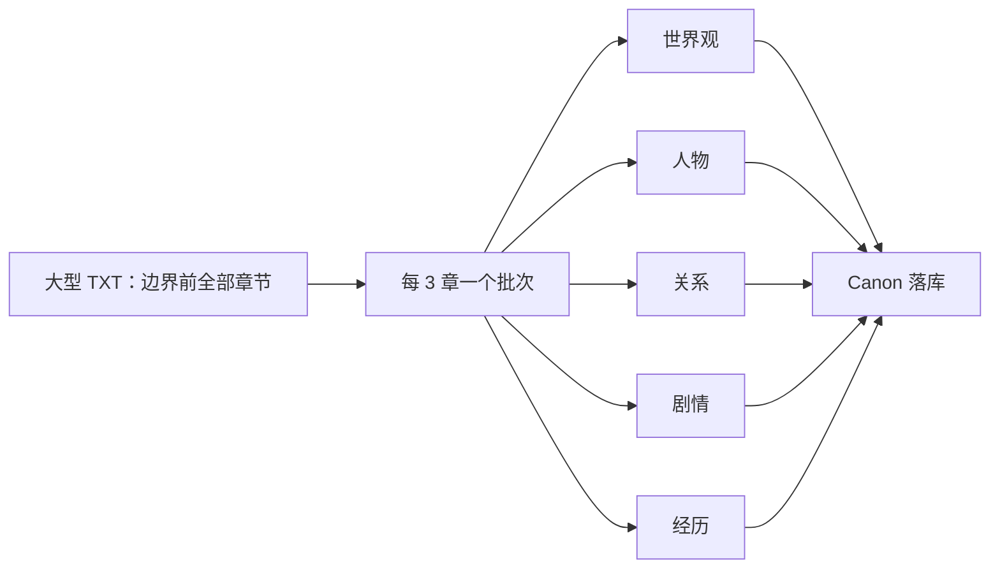
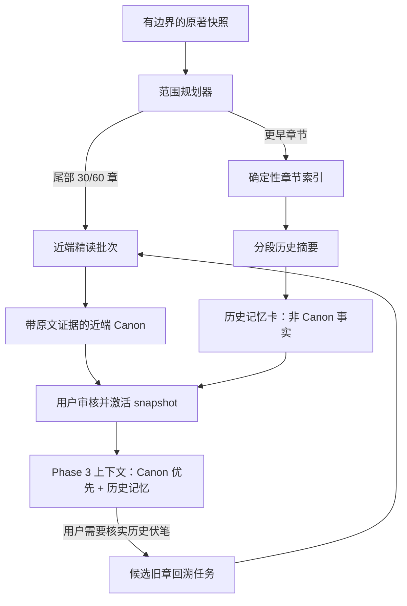

# 原著续写：大型 TXT 自适应加速分析建设方案

> 状态：Phase A、Phase B 已实施；Phase C（历史摘要、索引与上下文弱参考）实施中
> 日期：2026-07-28
> 适用版本：Schema 24 / 原著续写 Canon Phase 2、Phase 3 现有实现
> 目标：让“从原著最后一章开始续写”先获得可靠、可用的近端 Canon，而不是等待整本 TXT 完成逐章深度分析。

## 1. 结论与建设目标

对大型原著，采用 **近端精读 + 全局压缩记忆 + 按需回溯**。发起分析收束为两个档位，且两个档位都必须调用 LLM；不再提供基于确定性关键词/正则的 Quick Canon。

首个版本不改变原著边界、Canon snapshot、证据、人工审核和 Phase 3 只能通过 `CanonQueryService` 读取的约束。它只改变“哪些章节进入本次 LLM 精读”和“每批如何组织请求”。

用户可见产品形态：

| 模式 | 默认范围 | 适用场景 | 启动后的可用性 |
| --- | --- | --- | --- |
| 模式 | 默认范围与 LLM 策略 | 适用场景 | 启动后的可用性 |
| --- | --- | --- | --- |
| 快速续写分析（默认推荐） | LLM Standard；最后 30 个边界内章节，更早章节后续形成历史摘要/候选索引 | 从结尾直接续写 | 近端 Canon 审核并激活后即可写作 |
| 完整 Canon 分析 | LLM Deep；边界前全部章节 | 整体设定校对、长期项目治理 | 全书完成后 |

“快速”只表示**缩小精读范围和减少请求轮次**，不表示离线降级或降低事实证据标准。

### 1.1 可量化目标

以“边界前 300 章、默认每批 3 章”为典型基线：

- 快速续写只精读 30 章，LLM 正文输入量目标降低至少 80%。
- 通过两组物料提取替代现有五组提取，在线请求数目标降低至少 60%。
- 不因加速模式增加正文生成前的在线调用；按需回溯只能由用户显式触发或作为独立后台任务。
- 每个进入 Canon 的事实仍必须有位于边界以内的逐字证据；不允许用摘要伪造原文证据。
- 不把“未覆盖章节不存在该事实”作为任何推理结论。

时间指标受模型、网络和额度影响，不作为硬编码 SLA。应用应记录每次 run 的章节数、请求数、输入字符数、重试数与耗时，以实际设备和服务商数据验证上述相对指标。

## 2. 现状与根因

当前 `startAnalysis()` 通过 `continuationSourceReader.listBoundedSourceChapters()` 读取续写边界前的**所有**章节；默认每 3 章建立一个 batch。对于 Standard / Deep，每个 batch 会并行请求五类物料：世界观、人物、关系、剧情、经历。请求调度器将 Canon 在线并发限制为 2，因此五个长上下文请求会分多轮完成。

此外，每次物料请求都携带该 batch 的章节正文（每章最多 6,000 字符）和完整 JSON 框架。全书越长，输入文本、请求数量、重试机会和前台任务时长都近似线性增长。当前 `coverage` 虽可标记 `partial_chapter_coverage`，但没有一个明确、可解释的“为什么只分析了这一段”的范围契约，也没有面向续写起点的默认近端策略。



## 3. 不可突破的约束

- 继续使用 `ContinuationSourceSnapshot` 和 `BoundedSourceChapter`；不得直接读取 chunks/chapters 表，也不得读取续写边界后的原文。
- 继续保持 active snapshot 的原子激活：staging → 证据验证 → awaiting_review → ready；失败、取消和过期 run 不得污染 Phase 3。
- 每条 Canon 证据的 `char_start/char_end` 都是原著全局 UTF-16 半开区间，且完全不越过 boundary。
- 不能把摘要内容作为 `canon_evidence`，也不能因为摘要提及某事实而将其提升为 hard/locked 约束。
- 新建分析只能是在线 LLM 分析；`quick` 确定性提取退出产品与服务入口，不能创建或激活为 Canon。历史 quick 数据只保证可读取、可导出和可查看，不得再作为 Phase 3 的 active Canon。
- 分析模式与范围必须显式持久化，不能把“快速续写分析”偷换成低质量提取。
- 旧数据库中的 snapshot/run/checkpoint JSON 必须可读取；本轮不得令旧完整 Canon 失效。
- Phase 3、页面和生成代码仍只经 `CanonQueryService` 访问 Canon 表。

## 4. 目标架构



这里的“历史记忆卡”是上下文辅助信息，必须标明它是摘要而非 Canon 事实；它不能绕过 Canon 的证据和审核体系。Phase 3 应把它以“历史概览/可能相关，必要时请回溯原文核实”的弱参考注入，优先级低于 confirmed/locked Canon、近端人物状态和用户明确要求。

## 5. 数据与接口契约

### 5.1 新增范围对象

在 `src/services/continuation/canon/types.ts` 定义并版本化以下 JSON 契约：

```ts
export type AnalysisScopeKind = 'full' | 'tail' | 'adaptive';

export interface AnalysisScope {
  schemaVersion: 1;
  kind: AnalysisScopeKind;
  /** 仅 tail/adaptive：尾部精读章节数，按 boundary 向前计算。 */
  tailChapterCount: number | null;
  /** 仅 adaptive：更早章节的摘要分组大小。 */
  historicalSummaryGroupSize: number | null;
  /** 是否建立确定性候选索引；不触发 LLM。 */
  buildHistoricalIndex: boolean;
}

export interface CanonCoverage {
  schemaVersion: 2;
  sourceChapterCount: number;
  analyzedChapterCount: number;
  analyzedThroughPosition: SourceChapterPosition;
  analyzedRanges: Array<{ startPosition: SourceChapterPosition; endPosition: SourceChapterPosition }>;
  scope: AnalysisScope;
  historicalSummaryCoverage: {
    summarizedChapterCount: number;
    groupCount: number;
    status: 'none' | 'queued' | 'ready' | 'partial' | 'failed';
  };
  categoryCounts: Record<keyof CanonCapabilities, number>;
  incompleteReasons: string[];
}
```

`coverage_json` 与 `checkpoint_json` 均为已有 JSON 列，因此本阶段可先不做 SQLite schema migration。Repository 的 JSON 解析要兼容 Schema 1：缺少字段时视为 `kind: 'full'`、`analyzedRanges: []`、历史摘要 `none`，避免旧 snapshot 展示或 Phase 3 崩溃。

新增用户级模式（建议命名为 `ContinuationAnalysisMode = 'fast_continuation' | 'full_canon'`）并持久化到 checkpoint：

```ts
const ANALYSIS_MODE_PRESETS = {
  fast_continuation: {
    profile: 'standard',
    extractorMode: 'llm',
    scope: { kind: 'adaptive', tailChapterCount: 30 },
  },
  full_canon: {
    profile: 'deep',
    extractorMode: 'llm',
    scope: { kind: 'full', tailChapterCount: null },
  },
} as const;
```

`StartAnalysisInput` 改为接收 `mode: ContinuationAnalysisMode`；服务层从预设计算 profile、extractor 和 scope，禁止 UI 传入任意 `quick` 或 `deterministic` 组合。旧 run 的 checkpoint 仍按旧字段读取以便显示状态，但 quick run 不再恢复处理；它展示为“旧版离线预览，需重新进行 LLM 分析”，不允许激活为 active snapshot。

第一期不立即删除数据库 `profile='quick'` 的 CHECK 值和确定性代码，原因是旧备份、旧 run 和历史 snapshot 仍需无损读取。删除该兼容值只能在后续独立 migration 中进行；届时先将遗留 quick active pointer 清空并标记 `analysis_status='outdated'`，再删除创建入口、处理分支和测试 fixture。产品层面从 Phase A 起已经只有两个入口。

### 5.2 范围规划器

新增纯模块 `src/services/continuation/canon/analysisScopePlanner.ts`：

```ts
interface AnalysisPlan {
  nearChapters: BoundedSourceChapter[];
  historicalChapters: BoundedSourceChapter[];
  nearRanges: Array<{ startPosition: SourceChapterPosition; endPosition: SourceChapterPosition }>;
  effectiveScope: AnalysisScope;
  notes: string[];
}

function planAnalysisScope(
  chapters: BoundedSourceChapter[],
  scope: AnalysisScope,
): AnalysisPlan;
```

规则：

1. 所有输入均已由 `ContinuationSourceReader` 截断；规划器不读数据库、不修改状态。
2. full：全部章节进入 `nearChapters`，历史集合为空。
3. tail：从最后一个边界内章节向前取 `tailChapterCount`；不足时退化为 full。
4. adaptive：尾部精读同 tail；其余章节进入历史集合。默认取 30 章，允许 12–120 章，越界值在服务层 clamp 并在 `notes` 说明。
5. 若边界位于章节中间，最后一个 `BoundedSourceChapter` 已被截断，仍必须进入近端集合；不能重新读取完整章节。
6. plan 的范围、章节 ID 和输入 hash 要写入 run checkpoint；恢复任务必须复用同一计划，不得因为章节排序或 UI 配置变化扩大范围。

### 5.3 历史摘要与候选索引（第二阶段引入）

第一期加速只实施 tail scope 和请求合并；历史摘要放在第二期，以免把大改造和首个性能收益耦合。

第二期新增两个服务，优先复用现有仓储分层并通过 `services/database.ts` 暴露：

- `continuationHistoricalIndexService`：离线构建章节标题、首尾片段、规范化人名/别名、明显章节关键词与位置的倒排候选索引；不调用 LLM，不创建 Canon。
- `continuationHistoricalDigestService`：对历史章节按 20–50 章分组生成“事件、人物变化、世界规则、未解线索、对应章节位置”的短摘要；摘要单独持久化，带 source snapshot 指纹、覆盖范围和状态。

摘要表和索引表需在第二期以新 schema migration 引入，并加入 `schemaManifest`、备份/恢复和迁移夹具。不要把它们塞进 `continuation_analysis_batches.result_json`，否则无法按 source 变更局部失效，也会放大 run 表。

建议表名：`continuation_historical_digests`、`continuation_historical_digest_chapters`、`continuation_historical_index_terms`。所有记录必须绑定 project/source/source version/hash/parser/normalization/boundary，source 或 boundary 变化时随 Canon 一并标记过期。

## 6. 在线请求优化

### 6.1 五类请求改为两组请求

将现有每批五个 `AnalysisMaterialType` 合并为两组、保持同一证据 JSON 校验器和落库流程：

| 新请求组 | 包含字段 | 目的 |
| --- | --- | --- |
| `character_state` | characters、states、relationships、knowledge、experiences | 形成续写时最关键的“谁、在哪里、知道什么、关系如何” |
| `world_plot` | worldRules、plotThreads、timelineEvents | 形成世界规则、最近事件和未收束剧情 |

不能只因快速模式而跳过关系、时间线或知识边界。它们在同一请求中返回即可。每个请求仍只接受完整可解析 JSON；重试、JSON 恢复、证据验证、幂等、进度与失败恢复的语义保持不变。

为减小改动风险，实施时不要立即删除现有五类 `AnalysisMaterialType`：先引入 `AnalysisRequestGroup` 并让 work item 记录组名，或为 work item 新增可选 `request_group`。这是一次持久化任务协议变更，应有单独迁移和旧 run 恢复策略：旧 run 继续按五类完成；新 run 使用两组。不得让恢复中的旧 run 因枚举项数量变化而丢失已完成进度。

### 6.2 Token 与输出限制

- 输入文本上限仍按**每批总字符数**而不是“每章 6,000 字符 × 章节数”控制。新增 `maxBatchInputChars`（快速续写分析 12,000、完整 Canon 分析 18,000），在章节自然边界切分；超长单章再按段落切分并保留来源范围。
- 输出上限按请求组设定：`character_state` 需要较高预算，`world_plot` 较低。不得以降低 `max_tokens` 作为唯一提速手段，否则会增加 JSON 截断和 repair。
- 把模型请求、重试、输入字符数、输出长度、耗时写入既有 LLM usage log 的可用字段；如字段不足，第一期先记录到 run checkpoint 的 diagnostics，第二期再设计结构化诊断表。
- 并发上限继续默认 2。只在真实 provider RPM/TPM、Android 内存和失败率验收后，才允许配置化上调；不能以“更多并发”替代减少工作量。

## 7. 生成时的使用策略

### 7.1 Canon 与历史摘要的优先级

`continuationContextBuilder` 应按以下优先级打包，且继续遵守现有 token budget：

1. 用户写作目标与上一次续写状态。
2. confirmed/locked 的世界规则、活跃剧情与近端人物状态。
3. balanced 策略下的高置信度 pending Canon。
4. 与目标人物/关键词命中的历史摘要卡片（标记为“历史概览，非逐字核验事实”）。
5. 未命中的历史摘要不进入默认上下文。

`CanonQueryService.getContextBundle()` 应把 snapshot coverage 一并传递或提供独立 `getCoverageWarning()`，让调用方能显示“当前为最近 30 章分析；早期设定可能未覆盖”。它不能因为 coverage 不完整拒绝整个 snapshot；但必须禁止将缺失覆盖解释成“无此人物/无此关系/无此伏笔”。

### 7.2 按需回溯

第一期只提供用户操作入口：在历史摘要卡、Canon 缺口提示或生成前预览中，用户可选择“核实相关旧章”。应用根据关键词、人物别名、剧情标题和摘要组位置，列出候选章节；用户确认后才创建一个局部 Canon backfill run。

backfill run 约束：

- 仍绑定同一 source snapshot，范围仅覆盖用户确认的候选章节；每条新增事实都有这些章节中的原文证据。
- 不直接改写 active snapshot 中的行。应创建新的 staging snapshot，复制/引用旧有效 Canon 后合并新增内容，完成审核后原子替换 active snapshot；具体复制策略须在实施前通过 repository 事务设计评审。
- 若 source/boundary 已变化，backfill 必须过期，提示用户重新分析，不能将旧证据混入新边界。

自动根据模型“猜测”后台发起回溯会隐性增加网络调用，首版禁止。

## 8. UI 与交互

在 `CanonAnalysisOverviewScreen` 仅展示两个 LLM 分析入口，不再让用户拼接“档位 + 范围”形成不受支持的组合：

1. 默认卡片：**快速续写分析（推荐）**，显示“LLM 精读最后 30 章；早期章节后续可生成历史概览并补全”。
2. 次级卡片：**完整 Canon 分析**，显示“LLM 分析续写起点前的全书；耗时与 Token 更高”。
3. 创建任务前的确认框必须列出：精读章节数、历史章节数、是否联网、所用模型预设与预计请求组数；不要承诺不受服务商影响的绝对分钟数。
4. 任务页按“近端 Canon”“历史摘要”“补全任务”分别显示进度和可恢复状态，旧任务仍能按既有五类物料展示。
5. 旧 Quick run/snapshot 显示“离线预览已退役，不能用于续写”，仅允许查看、导出或删除；不显示开始/恢复/激活入口。
6. 激活部分覆盖 snapshot 前，二次确认说明：可以立即从结尾续写，但早期埋线/设定仍可通过“核实旧章”补全。
7. 生成上下文预览明确显示 coverage 警告；它是告知而非阻断。

所有文字通过主题系统渲染；页面不直接 SQL。

## 9. 分期施工计划

### Phase A：范围收敛与可观察性（首个可交付版本）

**范围：** 退役 Quick，新增两个固定的 LLM 分析模式、tail/adaptive 范围规划、覆盖率契约、UI 入口和指标；不引入历史摘要表，也不改变五类请求协议。

修改点：

- `src/services/continuation/canon/types.ts`：ContinuationAnalysisMode、AnalysisScope、Coverage v2 兼容解析类型；quick 仅保留为旧数据反序列化兼容值。
- `src/services/continuation/canon/analysisScopePlanner.ts`：纯范围规划与测试。
- `src/services/continuation/canon/canonAnalysisService.ts`：由固定模式预设写入 profile/extractor/scope/checkpoint；拒绝新的 deterministic/quick run；仅对 `nearChapters` 建 batch；恢复时只按已保存范围读取。
- `src/services/continuation/canon/canonRepository.ts`：Coverage v1 → v2 读取兼容。
- `src/screens/continuation/canon/CanonAnalysisOverviewScreen.tsx` 与任务页：两个 LLM 入口、确认、旧 Quick 退役提示和覆盖展示。
- `__tests__/canonAnalysisScopePlanner.test.ts`、`__tests__/canonAnalysisResume.test.ts`、屏幕测试：新增或扩展测试。

完成标准：快速续写分析只建立最后 30 个 bounded chapters 的 batch；两个新模式都使用 LLM；中断恢复不扩大范围；snapshot 可审核激活；页面可解释部分覆盖；旧 full run 保持原行为，旧 Quick 不能恢复或激活。

### Phase B：请求分组与任务迁移

**范围：** 新 run 采用两组请求，旧 run 保持五组恢复。

修改点：

- 为 work item 引入版本化请求协议（推荐新的 `request_group` 字段与 migration），或创建明确的 v2 work-item 表；二选一后写详细 migration spec。
- 更新 `canonAnalysisService`、提示词、进度展示、重试和测试 fixture。
- 对新 run 断言“每 batch 两次 LLM 请求”；对旧 fixture 断言“五类项目可恢复且不被重复执行”。

完成标准：同一确定性输入下，两组结果都通过 JSON/证据校验并可 materialize；任何一组失败不会错误标记 batch completed；请求数、重试和进度统计准确。

### Phase C：历史摘要、索引与显式回溯

**范围：** 引入持久化历史摘要/离线索引、上下文弱参考、用户确认后的局部回溯。

前置条件：Phase A、B 的 coverage 与 run 协议稳定；完成数据库设计评审和新 schema migration 方案。

完成标准：历史摘要在 source 或 boundary 变化时可靠过期；不产生伪 Canon evidence；用户能查看候选旧章并显式启动回溯；回溯产生的新 snapshot 只经审核后激活。

### Phase D：验收、调优与逐步放量

**范围：** 真机、服务商和旧项目验证；依据采样数据微调默认尾部章节数、输入长度和摘要组大小。

禁止在缺少证据时把默认 30 章直接提高并称为“更可靠”；必须以长篇验收的连续性缺陷率、回溯触发率、时延和 token 数据为依据。

## 10. 测试与验收矩阵

### 10.1 单元与服务测试

- full/tail/adaptive 的范围规划：空集、少于 N 章、正好 N 章、超长、排除章节、边界落在末章中间。
- 两个模式预设均强制 `extractorMode: 'llm'`；任何新建 `quick`/`deterministic` 输入都被拒绝；旧 Quick run/snapshot 只能读取，不能恢复、审核激活或被 Phase 3 采用。
- 快照不变性：source version/hash/parser/normalizer/boundary 任一变化后，tail run 与历史摘要均过期。
- tail run 只创建计划中的 batch，coverage 的 `analyzedRanges` 正确，`analyzedThroughPosition` 仍正确表达最后分析位置。
- resume 使用 checkpoint 的章节范围和 hash；不能因新的 UI 默认值或章节数改变重跑全书。
- Coverage v1 的老 snapshot 能加载，默认解释为全书模式。
- 两组请求：字段分配、空数组、JSON repair、逐字 evidence、future/orphan evidence、部分组失败与恢复。
- Context Builder：部分覆盖时不把“未命中”当否定事实；历史摘要低于 Canon；预算不足时优先丢弃历史摘要。
- backfill：候选列表不读未来原文；用户未确认不发网络请求；新 snapshot 激活原子性。

### 10.2 性能基准

建立脱敏的确定性章节 fixture：30、100、300 章三档，并记录：

| 指标 | 旧全书基线 | 快速续写目标 |
| --- | --- | --- |
| 精读章节数 | 所有边界内章节 | 30（可配置） |
| LLM 请求组数 | `ceil(chapters / batchSize) × 5` | Phase A 相同物料数但少读章节；Phase B 为 `ceil(30 / batchSize) × 2` |
| LLM 输入字符 | 批次正文总和 | 下降至少 80%（300 章基线） |
| 激活前完整性 | 全书 | 明示为近端/部分覆盖 |
| 证据越界/孤儿 | 0 | 0 |

不得把 mock LLM 的耗时当作真实手机/真实服务商速度；真实验收要记录模型、网络、设备、章节数、请求数、失败/重试和总耗时。

### 10.3 Android 验收

- 真机或模拟器导入大 TXT 的副本，边界设在最后一章。
- 运行“快速续写分析（最近 30 章、LLM）”，暂停、杀进程/重启、恢复并审核激活。
- 验证任务列表、通知进度、覆盖提示、Canon 分类页和上下文预览。
- 从结尾生成一章，检查近端人物状态、未收束主线未被遗漏；不得把摘要标为原文证据。
- 选择“核实旧章”，确认不会在用户确认前联网，确认后只处理候选章节。
- 对同一副本运行完整 Canon，比较关键人物状态、活跃剧情和世界规则；记录遗漏和误报，而非只记录运行成功。

所有截图、数据库副本和日志仅放在 `test-logs/continuation-adaptive-analysis-<date>/`，不得提交原著正文或污染仓库根目录。

## 11. 风险、降级与回滚

| 风险 | 控制措施 |
| --- | --- |
| 尾部 30 章遗漏早期硬设定 | 历史摘要弱参考、coverage 警告、用户显式回溯；完整 Canon 分析保留 |
| 把摘要当作事实 | 摘要与 `canon_evidence` 分表；UI 和 Context Builder 均明确标记，禁止 hard/locked 依据摘要生成 |
| 任务协议改造破坏恢复 | Phase A 不改 work item；Phase B 版本化协议，旧 run 固定走旧枚举 |
| source 修改后混用旧摘要 | 摘要绑定同一 source snapshot 指纹，统一走 existing invalidation 规则 |
| 降请求造成单次 JSON 太大或错误率上升 | 两组而非一次全量；保留独立重试和输出上限；以 JSON failure rate 设回退阈值 |
| 过度并发导致额度/内存问题 | 并发默认保持 2；优先缩小范围而非提并发 |
| 旧 Quick snapshot 曾被激活 | 启动时识别并将其标记为“需要 LLM 重新分析”；Phase 3 拒绝读取，避免无证据离线结果参与续写 |

功能开关建议放在服务层的显式 scope 参数中，不新增隐式远程配置。若 Phase B 的 JSON 无效率高于现有五类协议，按新 run 回退为五类请求；已完成的请求组不可重跑，须按持久化状态继续。

回滚策略：禁用快速续写入口即可；既有 full run、snapshot、证据和生成路径不变。已激活的部分覆盖 snapshot 仍可读取，但 UI 应继续标记其范围，不能删除用户已经审核的记录。

## 12. 实施顺序与质量门禁

1. 先为 Phase A 写范围规划和恢复失败测试，再实现服务与 UI。
2. 运行 Canon 专项 Jest、screen 测试、迁移测试（Phase B/C 时）和 `npm run verify`。
3. 每个 Phase 的数据契约、兼容行为和实际基准结果更新到 `docs/optimization/`。
4. 未经维护者明确要求，不在本方案实施阶段修改版本号、构建 Release APK 或创建新 keystore。
5. 最终使用 `git diff --check` 与 `git status --short` 确认没有混入用户现有未提交的 Canon 修复、根目录调试文件或原著内容。

## 13. 建议的提交拆分

```text
test(continuation): define adaptive scope and resume contracts
feat(continuation): add tail-scoped Canon analysis and coverage metadata
feat(continuation): expose continuation analysis scope and coverage in UI
test(continuation): lock grouped extraction compatibility
feat(continuation): reduce Canon analysis to two request groups
feat(continuation): add historical digests and explicit source backfill
docs(continuation): record adaptive analysis benchmarks and acceptance
```

每个提交必须能通过相关测试。Schema migration、请求协议转换和历史摘要持久化不应与范围 UI 或无关 Canon 修复混在同一提交。
